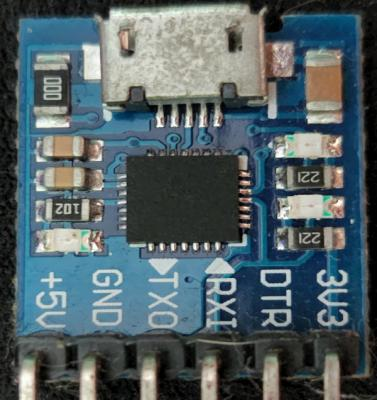
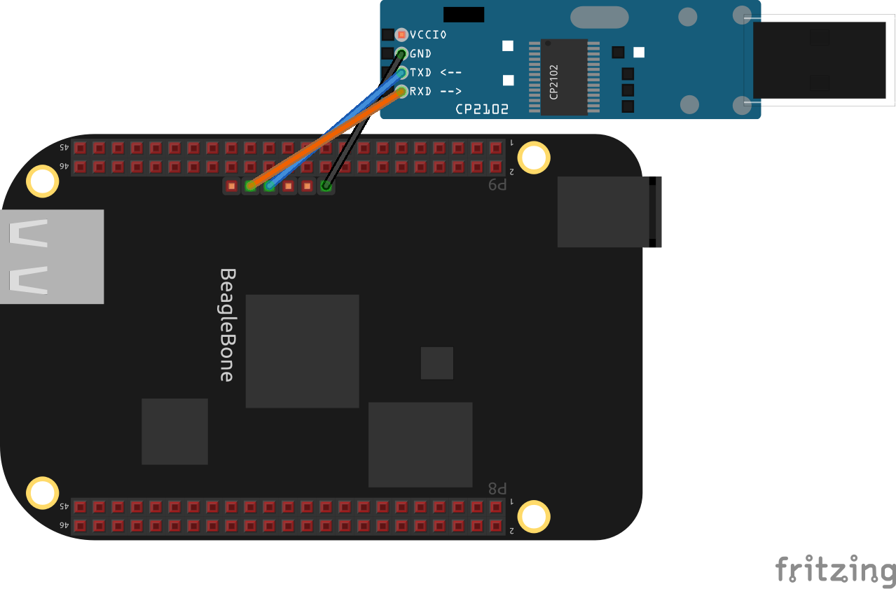
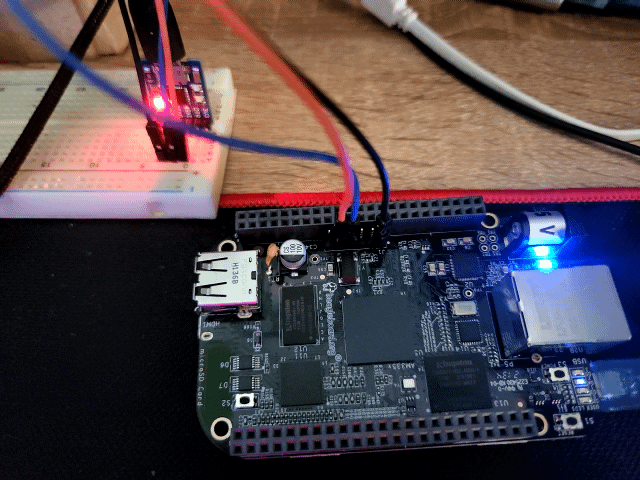

# USB Serial na Beaglebone

Para conseguir *debuggar* possíveis problemas, é importante visualizar os logs da porta ==UART==.

## Dispositivo

Estou usando o módulo [USB Serial](https://www.filipeflop.com/produto/modulo-conversor-usb-ttl-cp2102-serial-rs232/) equipado com um chip [CP2102](https://www.silabs.com/documents/public/data-sheets/CP2102-9.pdf)

<figure markdown>
  { width="600";height="10" } 
  <figcaption>
  Módulo Conversor USB TTL CP2102 Serial RS232
  </figcaption>
</figure>

## Conexões

A *Beaglebone* tem seus pinos de ==UART== separados das outras ==GPIOs==, isso facilita na hora de fazer as conexões.

<figure markdown>
  { width="600" } 
  <figcaption>
  Conexão entre a beaglebone e o módulo USB Serial
  </figcaption>
</figure>

## Visualizando os logs

Depois de fazer as conexões, podemos utilizar alguns programas para visualizar os logs que saem da ==UART==. Dentre eles, exitem:

- Minicom
- Screen
- Picocom
- E muitos outros

Até o momento estou usando o Minicom, mas já usei bastante o Screen.

## Resultado

<figure markdown>
  { width="600" } 
  <figcaption>
  Visualizando os logs da UART
  </figcaption>
</figure>

<figure markdown>
  { width="600" } 
  <figcaption>
  Conexão com a Beaglebone
  </figcaption>
</figure>