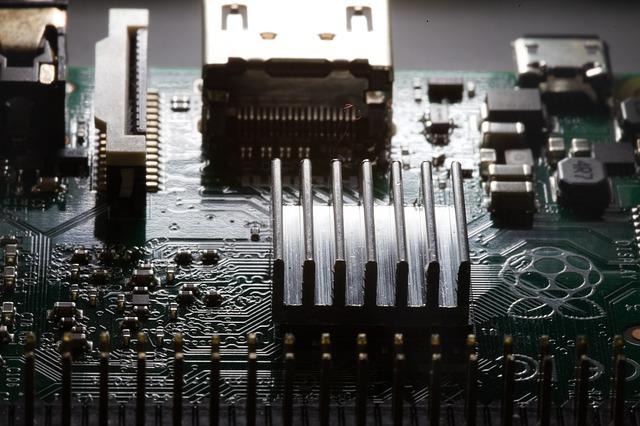

# Boot.img

Image by <a href="https://pixabay.com/users/dexmac-12233086/?utm_source=link-attribution&amp;utm_medium=referral&amp;utm_campaign=image&amp;utm_content=5925621">dexmac</a> from <a href="https://pixabay.com/?utm_source=link-attribution&amp;utm_medium=referral&amp;utm_campaign=image&amp;utm_content=5925621">Pixabay</a>

## 1. Introdução

A algum tempo venho tentando desbravar o mundo do Android embarcado. Sem sombra de dúvidas é uma área super interessante, mas os desafios são enormes. O sistema está crescendo desenfreadamente e os livros e fontes de estudo não estão conseguindo acompanhar essa evolução. Além disso, a [documentação](https://source.android.com/devices/architecture) na parte do sistema é muito superficial, ao contrário da parte de desenvolvimento de aplicações ([documentação](https://developer.android.com/guide)) que também possuem vários cursos pela Internet. 

## 2. Dispositivo usado

[Em breve]

## 3. Antes de Começar

[Em breve]

- [Instalando Dependências](https://source.android.com/setup/build/initializing)
- [Instalando o Repo](https://source.android.com/setup/develop#installing-repo)
- []

## 4. 