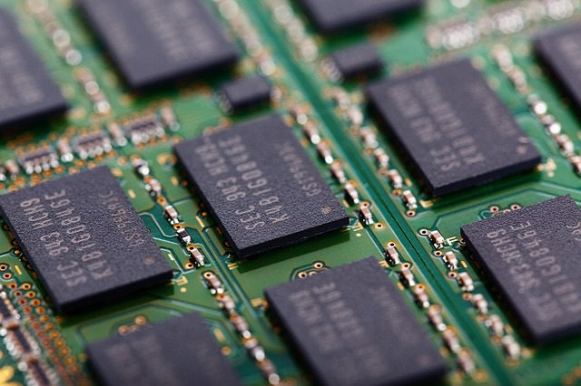

# Usando U-boot com qemu



Image by <a href="https://pixabay.com/users/publicdomainpictures-14/?utm_source=link-attribution&amp;utm_medium=referral&amp;utm_campaign=image&amp;utm_content=22098">PublicDomainPictures</a> from <a href="https://pixabay.com/?utm_source=link-attribution&amp;utm_medium=referral&amp;utm_campaign=image&amp;utm_content=22098">Pixabay</a>


## 1. Introdução

A fim de ter um ambiente de testes para aprender sobre o U-Boot, o mais recomendado é criar um ambiente virtual. Para isso, eu escolhi o QEMU, que é altamente configurável.

Essa postagem tem como base a arquitetura `aarch64`, devido sua larga utilização em sistemas embarcados.

## 2. Baixando o U-Boot mainline

Basta copiar e colar o código abaixo: 

```
git clone https://source.denx.de/u-boot/u-boot.git
```

## 3. Buildando o U-boot

A seguir são definidos alguns passos para gerar o binário do U-boot, que será utilizado pelo QEMU.

### 3.1. Instalando Dependências

Dependendo do sistema utilizado, alguns pacotes serão necessários para que o processo de build tenha sucesso. No meu ambiente (`ubuntu 22.04`), foram necessário os seguintes pacotes:

```
sudo apt install \
    flex \
    bison \
    gcc-aarch64-linux-gnu \
```

### 3.2. Definindo a Arquitetura

Para criar um sistema de build limpo, o parâmetro `O=` foi utilizado. Dentro da pasta do U-Boot, cole o código abaixo:

```
make O=../out qemu_arm64_defconfig -j16
```

Se tudo ocorrer bem, a mensagem a seguir deve aparecer:


Uma pasta `out` foi criada, adicionando todos os itens necessários para a build.


### 3.3 Gerando o Binário

Dentro da pasta `out`, cole o código abaixo:

```
make CROSS_COMPILE=aarch64-linux-gnu- -j16
```

Se tudo ocorrer corretamente o arquivo `u-boot.bin` será criado.


# 4. Carregando o U-boot com QEMU

Para utilizar o QEMU para arquiteturas ARM64 é necessário instalar o pacote:

```
sudo apt install qemu-system-arm
```

Dentro da pasta `out`, execute o seguinte comando:

```
qemu-system-aarch64 -M virt -nographic -cpu cortex-a57  -bios u-boot.bin
```

onde o parâmetro `-bios` é o binario que acabou de ser criado pela nossa build.

Após executar o comando, o u-boot deverá iniciar normalmente:

