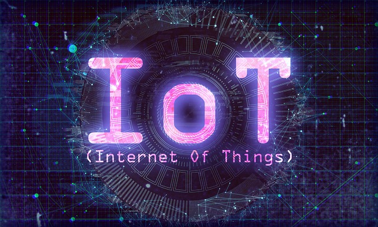

# Zephyr + Esp32 + Blinky = ❤️



Image by <a href="https://pixabay.com/users/methodshop-1460919/?utm_source=link-attribution&amp;utm_medium=referral&amp;utm_campaign=image&amp;utm_content=3404892">methodshop</a> from <a href="https://pixabay.com/?utm_source=link-attribution&amp;utm_medium=referral&amp;utm_campaign=image&amp;utm_content=3404892">Pixabay</a>

## 1. Introdução


Recentemente voltei a pesquisar sobre *Internet of Things* (IoT) e durante uma conversas no trabalho fiquei sabendo do Zephyr. Por sorte, um [Webnar](https://youtu.be/UtLfhNw0lQg) da [Embarcados](https://www.embarcados.com.br/) aconteceu e pude me interar mais sobre essa plataforma. Só tenho uma palavra para definir: **Sensacional** 🤯

## 2. Instalando dependências

Estou usando `Ubuntu 22.04`.

```
sudo apt install --no-install-recommends git cmake ninja-build gperf \
  ccache dfu-util device-tree-compiler wget \
  python3-dev python3-pip python3-setuptools python3-tk python3-wheel xz-utils file \
  make gcc gcc-multilib g++-multilib libsdl2-dev
```

O Zephyr usa o python para gerenciar os pacotes, algumas dependências também são necessárias

```
pip3 install west
```
Após isso, é necessário definir o local onde os arquivos serão salvos. No exemplo vou usar o caminho `/home/jao/Documents/Workspace/IoT`

```
west init /home/jao/Documents/Workspace/IoT/PASTA_DO_ZEPHYR
```

Alguns arquivos serão baixados do [repositório](https://github.com/zephyrproject-rtos).

Em seguida:

==PS: Demora...==

```
cd /home/jao/Documents/Workspace/IoT/PASTA_DO_ZEPHYR
west update
```

Depois de terminar a atualização, é necessário exportar algumas variáveis de ambiente:

```
west zephyr-export
```

e então instalar as depêncencias restantes do python:

```
pip3 install -r /home/jao/Documents/Workspace/IoT/PASTA_DO_ZEPHYR/zephyr/scripts/requirements.txt
```


## 3. Baixando a toolchain 

Como vamos utilizar o Esp32, a toolchain pode ser baixada [aqui](https://docs.espressif.com/projects/esp-idf/en/v4.2/esp32/api-guides/tools/idf-tools.html#xtensa-esp32-elf). No meu caso estou usando a plataforma `linux-amd64`

Após baixar a toolchain correto, extraia e adicione o caminho da pasta a variável de ambiente `ESPRESSIF_TOOLCHAIN_PATH`

```
export ESPRESSIF_TOOLCHAIN_PATH=/home/jao/Documents/Workspace/IoT/xtensa-esp32-elf/xtensa-esp32-elf/
```

É necessário adicionar outra variável:

```
export ZEPHYR_TOOLCHAIN_VARIANT="espressif"
```

Finalmente, podemos baixar os pacotes referentes ao Esp32 do Zephyr:

==PS: O camando deve ser dado dentro da pasta do Zephyr, no caso: /home/jao/Documents/Workspace/IoT/PASTA_DO_ZEPHYR==

```
west espressif update
```

Após esse passo, o ambiente de configuração para o Esp32 estará finalizado.

## 4. Exemplo Blinky

Na versão atual do Zephyr `3.0.0`, é necessário adicionar um módulo no *device driver* para que o led *built-in* sejá reconhecido. Para isso, é necessário criar um arquivo dentro do exemplo do Blincky do próprio Zephyr

```
touch /home/jao/Documents/Workspace/IoT/PASTA_DO_ZEPHYR/zephyr/samples/basic/blinky/esp32.overlay
```

o arquivo deve conter o seguinte conteúdo:

```
/ {
	aliases {
		led0 = &led0;
	};

	leds {
		compatible = "gpio-leds";
		led0: led_0 {
			gpios = <&gpio0 2 GPIO_ACTIVE_HIGH>;
			label = "LED 0";
		};
	};
};
```

Na linha `gpios = <&gpio0 2 GPIO_ACTIVE_HIGH>;`, o número 2 é referente ao gpio associado ao led *built-in*.

Agora é só compilar:

==PS: dentro da pasta: /home/jao/Documents/Workspace/IoT/PASTA_DO_ZEPHYR/==

```
west build -p auto -b esp32  zephyr/samples/basic/blinky
```

> Muitas vezes o arquivo CMakeCache.txt, precisa ser deletado. Ele fica localizado em : /home/jao/Documents/Workspace/IoT/PASTA_DO_ZEPHYR/build/

Se tudo ocorrer bem, a seguinte mensagem deve aparecer:

```
[103/103] Linking C executable zephyr/zephyr.elf
Memory region         Used Size  Region Size  %age Used
     mcuboot_hdr:          32 B         32 B    100.00%
        metadata:          28 B         32 B     87.50%
             ROM:       31172 B    4194240 B      0.74%
     iram0_0_seg:       13004 B       128 KB      9.92%
     irom0_0_seg:       13692 B    3342304 B      0.41%
     dram0_0_seg:        1240 B     180736 B      0.69%
     dram0_1_seg:         53 KB     110032 B     49.32%
     drom0_0_seg:        3826 B    4194240 B      0.09%
    rtc_iram_seg:          0 GB         8 KB      0.00%
    rtc_slow_seg:          0 GB         4 KB      0.00%
        IDT_LIST:          0 GB         8 KB      0.00%
esptool.py v3.3-dev
Creating esp32 image...
Merged 6 ELF sections
Successfully created esp32 image.
```

Para flashar no esp32, pasta digitar o seguinte comando:

```
west flash
```

O resultado deve ser algo semelhante:

```
Flash will be erased from 0x00010000 to 0x00033fff...
Flash params set to 0x0220
Wrote 32768 bytes at 0x00001000 in 0.7 seconds (390.4 kbit/s)...
Hash of data verified.
Wrote 16384 bytes at 0x00008000 in 0.3 seconds (515.8 kbit/s)...
Hash of data verified.
Wrote 147456 bytes at 0x00010000 in 2.0 seconds (594.7 kbit/s)...
Hash of data verified.

Leaving...
Hard resetting via RTS pin...
```

Se o seguinte erro acontecer:

> /dev/ttyS0 failed to connect: Failed to connect to Espressif device: No serial data received.
For troubleshooting steps visit: https://docs.espressif.com/projects/esptool/en/latest/troubleshooting.html

> A fatal error occurred: Could not connect to an Espressif device on any of the 2 available serial ports.

Talvel seja necessário ficar segurando o botão `boot` do Esp32.

É isso, até a próxima.

