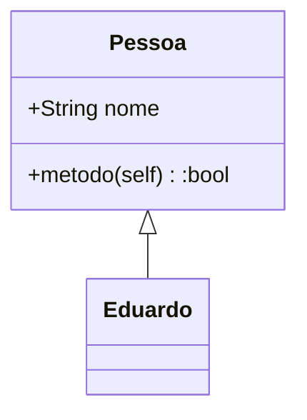

# Documentação com MKDOCS


Image by <a href="https://pixabay.com/users/wikiimages-1897/?utm_source=link-attribution&amp;utm_medium=referral&amp;utm_campaign=image&amp;utm_content=11107">WikiImages</a> from <a href="https://pixabay.com/?utm_source=link-attribution&amp;utm_medium=referral&amp;utm_campaign=image&amp;utm_content=11107">Pixabay</a>

## Introdução
O [MKDocs](https://www.mkdocs.org/) é uma biblioteca focada em documentação, desenvolvida em python. Ela possui várias funcionalidades e algumas delas serão mostradas abaixo.

Para instalar:

```
pip install mkdocs
```

Após a instalãção basta digitar:

```
mkdocs new TESTE
```

Os arquivos necessários para iniciar a documentação serão criados.


## Markdown Básico

### Título (H1)
```
# Exemplo
```

### Subtitulo (H2)
```
## Exemplo
```

### Subsubtitulo (H3)
```
### Exemplo
```

### Negrito
```
**Exemplo**
```
> **Exemplo**

### Itálico
```
*Exemplo*
```
> *Exemplo*

### Citação
```
> Exemplo
```
> Exemplo

### Lista Ordenada
```
1. Exemplo
2. Exemplo
3. Exemplo
```
> 1. Exemplo
> 2. Exemplo
> 3. Exemplo

### Lista Não Ordenada
```
- Exemplo
- Exemplo
- Exemplo
```
> - Exemplo
> - Exemplo
> - Exemplo

### Linha de Código
```
`Código`
```

> `Código`

### Link
```
[Site do google](https://www.google.com.br)
```
> [Site do google](https://www.google.com.br)

### Tabela
```
| Nome | Idade |
| ---- | ----- |
| João | 28    |
| Pedro | 34   |
```
> | Nome | Idade |
> | ---- | ----- |
> | João | 28    |
> | Pedro | 34   |


## Lista de Tarefas

- [ ] Checado.
- [ ] Checado 2.
- [X] Done.

## Bloco de código

```{.py3 linenums="44" title="teste.py" hl_lines="1-3"}
def xpto():
    """Docstring"""
    return True
```

## Emoji

:snake: :heart: :rocket:

## Tachado

~~Tachado~~

## Realçado

==realçado==

## Custom Fences

