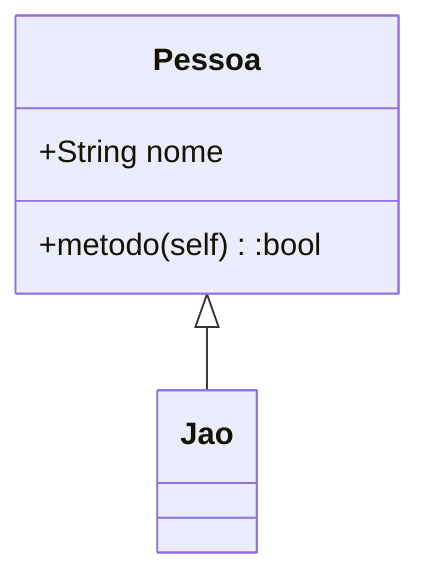

# Documentação com MKDOCS


Image by <a href="https://pixabay.com/users/wikiimages-1897/?utm_source=link-attribution&amp;utm_medium=referral&amp;utm_campaign=image&amp;utm_content=11107">WikiImages</a> from <a href="https://pixabay.com/?utm_source=link-attribution&amp;utm_medium=referral&amp;utm_campaign=image&amp;utm_content=11107">Pixabay</a>

## 1. Introdução

> Essa postagem foi inspirado na [live de python #189](https://youtu.be/GW6nAJ1NHUQ). Se quiser mais informações sobre MKDocs da uma olhada no vídeo e deixa o like. :thumbsup:

O [MKDocs](https://www.mkdocs.org/) é uma biblioteca focada em documentação, desenvolvida em python. Ela possui várias funcionalidades e algumas delas serão mostradas abaixo.

Para instalar:

```
pip install mkdocs
```

Após a instalação basta digitar:

```
mkdocs new TESTE
```

Os arquivos necessários para iniciar a documentação serão criados.


## 2. Markdown Básico

Comandos disponíveis por padrão na biblioteca.

### 2.1. Título (H1)
```
# Exemplo
```

### 2.2. Subtitulo (H2)
```
## Exemplo
```

### 2.3. Subsubtitulo (H3)
```
### Exemplo
```

### 2.4. Negrito
```
**Exemplo**
```
> **Exemplo**

### 2.5. Itálico
```
*Exemplo*
```
> *Exemplo*

### 2.6. Citação
```
> Exemplo
```
> Exemplo

### 2.7. Lista Ordenada
```
1. Exemplo
2. Exemplo
3. Exemplo
```
> 1. Exemplo
> 2. Exemplo
> 3. Exemplo

### 2.8. Lista Não Ordenada
```
- Exemplo
- Exemplo
- Exemplo
```
> - Exemplo
> - Exemplo
> - Exemplo

### 2.9. Linha de Código
```
`Código`
```

> `Código`

### 2.10. Link
```
[Site do google](https://www.google.com.br)
```
> [Site do google](https://www.google.com.br)

### 2.11. Tabela
```
| Nome | Idade |
| ---- | ----- |
| João | 28    |
| Pedro | 34   |
```
> | Nome | Idade |
> | ---- | ----- |
> | João | 28    |
> | Pedro | 34   |


## 3. Markdown Estendido

Para ter ainda mais funcionalidades, é necessário instalar a biblioteca [PyMdown Extensions](https://facelessuser.github.io/pymdown-extensions/):

```
pip install pymdown-extensions
```

Além disso, é necessário adicionar quais extensões serão usadas dentro do arquivo `mkdocs.yml`, por exemplo:

```
markdown_extensions:
  - pymdownx.tasklist
  - pymdownx.emoji
  - pymdownx.mark
  - pymdownx.tilde
```

Cada uma dessas extensões serão mostradas a seguir.

### 3.1. Lista de Tarefas
`pymdownx.tasklist`

```
- [ ] Checar.
- [ ] checar.
- [X] checado.
```
> - [ ] Checar.
> - [ ] checar.
> - [X] checado.

### 3.2. Emoji

Para mais emojis: [emojipedia](https://emojipedia.org/twitter/). Escolha um emoji e procure por `Shortcodes`.

`pymdownx.emoji`

```
:snake: :heart: :rocket:
```
> :snake: :heart: :rocket:

### 3.3. Tachado
`pymdownx.tilde`
```
~~Exemplo~~
```
> ~~Exemplo~~

### 3.4. Realçado
`pymdownx.mark`

```
==Exemplo==
```
> ==Exemplo==

## 4. Super Fences

Dentro do `pymdown-extensions` existe uma funcionalidade que merece um tópico a parte, chamado de  `superfences`. Com ele, o MKDocs fica ainda mais poderoso.

É necessário informar para o MKDocs que o super fences será utilizado, adicionando as linhas dentro do `mkdocs.yml`:

```
markdown_extensions:
  # ...
  - pymdownx.superfences:
      custom_fences:
        - name: mermaid
          class: mermaid
          format: !!python/name:pymdownx.superfences.fence_div_format

extra_javascript:
  - https://unpkg.com/mermaid@8.5.1/dist/mermaid.min.js
```

### 4.1. Bloco de código
`pymdownx.superfences`

```
    ```{.py3 linenums="44" title="teste.py" hl_lines="1 3"}
    def xpto():
        """Docstring"""
        return True
    ```
```

```{.py3 linenums="44" title="teste.py" hl_lines="1 3"}
def xpto():
    """Docstring"""
    return True
```

### 4.2. Fórmulas 
`pymdownx.arithmatex`

```
$$ \operatorname{ker} f=\{g\in G:f(g)=e_{H}\}{\mbox{.}} $$
```
> $$ \operatorname{ker} f=\{g\in G:f(g)=e_{H}\}{\mbox{.}} $$

```
The homomorphism $f$ is injective if and only if its kernel is only the 
singleton set $e_G$, because otherwise $\exists a,b\in G$ with $a\neq b$ such 
that $f(a)=f(b)$.
```


> The homomorphism $f$ is injective if and only if its kernel is only the 
singleton set $e_G$, because otherwise $\exists a,b\in G$ with $a\neq b$ such 
that $f(a)=f(b)$.

### 4.3. Custom Fences

É possível incorporar outras bibliotecas dentro do MKDocs, por exemplo a [Mermaid](https://mermaid-js.github.io/mermaid/#/) que é uma biblioteca para gerar diagramas e gráficos. Para isso, é necessário adicionar no `mkdocs.yml`

```
  - pymdownx.superfences:
      custom_fences:
        - name: mermaid
          class: mermaid
          format: !!python/name:pymdownx.superfences.fence_div_format

extra_javascript:
  - https://unpkg.com/mermaid@8.5.1/dist/mermaid.min.js
```

```
    ```mermaid
    classDiagram
        Pessoa <|-- Eduardo
        class Pessoa{
            +String nome
            +metodo(self):bool
        }
    ```
```

