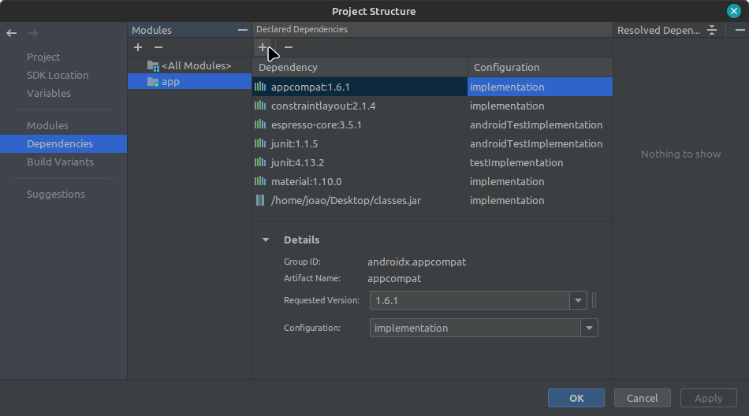
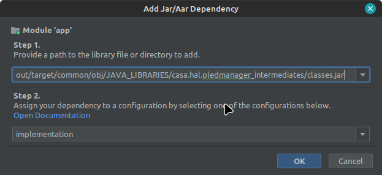

# HAL Manager

<figure markdown>
  { width="600" }
  <figcaption>
    Image by <a href="https://pixabay.com/users/serenawong-3060442/?utm_source=link-attribution&utm_medium=referral&utm_campaign=image&utm_content=1633667">Serena Wong</a> from <a href="https://pixabay.com//?utm_source=link-attribution&utm_medium=referral&utm_campaign=image&utm_content=1633667">Pixabay</a>
  </figcaption>
</figure>

## Introdução

Quando comecei a aprender sobre a **Hardware Abstration Layer** (HAL), notei que da forma como eu esteva fazendo, era preciso que o código da aplicação que fazia o uso do serviço da HAL tinha que estar junto com o código do meu produto. Essa abordagem não fazia o menor sentido, uma vez que para fazer as aplicações, é bem mais prático utilizar o Android Studio e embarcar a aplicação por meio dele. Isso me incomodou durante um tempo, mas agora vou compartilhar uma possível solução para esse problema 🫠   .


> Gostaria de agradecer ao [Gabriel Villacrez](https://www.linkedin.com/in/gabriel-villacrez/) e ao [Álison Venâncio](https://www.linkedin.com/in/alvenan/) que compartilharam seus conhecimentos sobre HAL Manager ([Post do Stackoverflow](https://stackoverflow.com/questions/76640941/how-can-write-an-app-that-calls-the-service-through-the-hal)).

## A HAL

Atualmente estou fazendo um *device driver* do [**Display OLED 128x64 0.96" I2C**](https://www.makerhero.com/produto/display-oled-0-96-i2c-azul-amarelo/) e junto com ele uma HAL para escrever mensagens no display e limpar a tela. Por fim, queria fazer uma aplicação que consumisse o serviço dessa HAL. Com essa necessidade, aproveitei para fazer o uso da HAL Manager e gerar minha aplicação direto do Android Studio.

## HAL Manager

Criei os seguintes arquivos no caminho `device/casa/jaodroid/interfaces/interfaces/oled/aidl/oled_manager`, a partir da raiz do AOSP:

```{.c  linenums="1"  hl_lines="6" title=Android.bp}
java_library {
    name: "casa.hal.oledmanager",
    srcs: ["src/**/*.java"],
    static_libs: ["casa.hal.oled-V1-java"],
    required:["casa.hal.oledmanager.xml"],
    system_ext_specific: true,
    platform_apis: true,
    installable: true,
}

prebuilt_etc {
    name: "casa.hal.oledmanager.xml",
    src:  "casa.hal.oledmanager.xml",
    filename_from_src: true,
    relative_install_path: "permissions",
    system_ext_specific: true,
}
```

```{.xml  linenums="1" title=casa.hal.oledmanager.xml}
<?xml version="1.0" encoding="utf-8"?>
<permissions>
    <library 
        name="casa.hal.oledmanager" 
        file="/system_ext/framework/casa.hal.oledmanager.jar"
    />
</permissions>
```

```{.java  linenums="1" hl_lines="4" title=src/casa/hal/oledmanager/OledManager.java}
package casa.hal.oledmanager;

import android.util.Log;
import android.os.ServiceManager;
import android.os.IBinder;
import android.os.RemoteException;

import casa.hal.oled.IOled;

public class OledManager 
{
    private IBinder service;
    private IOled oledInterface;   
    private static final String INTERFACE = "casa.hal.oled.IOled/default";
    private static OledManager instance;

    private OledManager()
    {
        service = ServiceManager.getService(INTERFACE);

        if(service == null)
            Log.e("OledManager", "Service not available");

        oledInterface = IOled.Stub.asInterface(service);

        if (oledInterface == null)
            Log.e("OledManager", "Oled Interface not available");        
        
    }

    public static OledManager getInstance()
    {
        if(instance == null)
            instance = new OledManager();
        
        return instance;
    }

    public boolean clearDisplay() throws RemoteException {
        return oledInterface.clearDisplay();
    }

    public boolean writeString(String text) throws RemoteException {
        return oledInterface.writeString(text);
    }
}
```

Por fim, precisamos adicionar o *OledManger* no produto:

```{.mk linenums="1" hl_lines="6" title=jaodroid.mk}
PRODUCT_PACKAGES += \
    testOLED \
    casa.hal.oled \
    casa.hal.oled-service \
    OLedTest \
	casa.hal.oledmanager
```

A hierarquia de arquivos e pastas ficou dessa forma:

```{.sh}
device/casa/jaodroid/interfaces/oled/aidl/oled_manager
├── Android.bp
├── casa.hal.oledmanager.xml
└── src
    └── casa
        └── hal
            └── oledmanager
                └── OledManager.java

4 directories, 3 files
```

### Observações

O HAL Manager fica situado dentro da partição `system_ext` (linha 6 do `Android.bp`). Geralmente precisamos fazer o uso dessa partição quando algo em partições distintas. Nesse caso, a HAL está na partição `vendor`, mas para utilizar o HAL Manager precisamos de coisas que estão na partição `system`. Como é o caso do `android.os.ServiceManager` (linha 4 do `OledManager.java`). O código fonte do `ServiceManger` está em:

```{.java linenums="1" hl_lines="8" title=frameworks/base/core/java/android/os/ServiceManager.java}

...
/**
 * Manage binder services as registered with the binder context manager. These services must be
 * declared statically on an Android device (SELinux access_vector service_manager, w/ service
 * names in service_contexts files), and they do not follow the activity lifecycle. When
 * building applications, android.app.Service should be preferred.
 *
 * @hide
 **/
@SystemApi(client = SystemApi.Client.MODULE_LIBRARIES)
public final class ServiceManager {
...

```

Observe que a linha 8 possui o comentário `@hide`. Em resumo, aplicações que estão nas partições `vendor`, `product` ou `data` não podem acessar as *hidden APIs* (para mais informações acesse o [link](https://source.android.com/docs/core/architecture/partitions/product-interfaces#java-interfaces)). Dessa forma, para fazermos a comunicação entre essas essas partições devemos utilizar a partição `system_ext` ([mais informações](https://source.android.com/docs/core/architecture/partitions/shared-system-image#ssi-overview))

!!! note "Nota"
    Consegui essas informações no curso [Android 12 Internals material, labs and discussion](https://8mantech.thinkific.com/courses/take/android-internals/texts/22836673-android-bp-moving-the-app-from-the-vendor-to-the-system-ext-partition-ssi)


## Android Studio

Com o HAL Manager compilado, são gerados alguns arquivos. Um deles podemos importar dentro do Android Studio, esse arquivo fica em

```{linenums="1" hl_lines="3"}
out/target/common/obj/JAVA_LIBRARIES/casa.hal.oledmanager_intermediates/
├── classes-header.jar
├── classes.jar
└── javalib.jar

0 directories, 3 files

```

Onde `casa.hal.oledmanager` é o nome do HAL Manager. O arquivo que deve ser importado é o `classes.jar`.

Dentro do Android Studio, podemos importar em: `Build > Edit Libraries and Dependencies...`, a seguinte janela irá aparecer:

<figure markdown>
  { width="600" }
  <figcaption>
    Bibliotecas.
  </figcaption>
</figure>

Agora é so clicar em ` + > 2 JAR/AAR Dependency` (em *Declared Dependecies*), a seguinte tela deve aparecer:

<figure markdown>
  { width="600" }
  <figcaption>
    Dependências.
  </figcaption>
</figure>

Basta colocar o caminho do arquivo `classes.jar` e a parte de configuração está completa.

## Aplicação

Basicamente criei um projeto e modifiquei esses 2 arquivos:

```{.java linenums="1" hl_lines="4 16 31 41" title=MainActivity.java}

package com.example.oled;

import androidx.appcompat.app.AppCompatActivity;
import casa.hal.oledmanager.OledManager;
import android.os.Bundle;
import android.os.RemoteException;
import android.widget.Button;
import android.widget.EditText;

public class MainActivity extends AppCompatActivity {

    Button sendText;
    Button clearDisplay;
    EditText oledText;

    private OledManager oledManger = OledManager.getInstance();
    @Override
    protected void onCreate(Bundle savedInstanceState) {
        super.onCreate(savedInstanceState);
        setContentView(R.layout.activity_main);

        sendText = findViewById(R.id.sendTextBt);
        clearDisplay = findViewById(R.id.clearOledBt);
        oledText = findViewById(R.id.oledtext);

        sendText.setOnClickListener(v -> {

            String text = String.valueOf(oledText.getText());

            try {
                oledManger.writeString(text);
            } catch (RemoteException e) {
                throw new RuntimeException(e);
            }

        });

        clearDisplay.setOnClickListener(v -> {

            try {
                oledManger.clearDisplay();
            } catch (RemoteException e) {
                throw new RuntimeException(e);
            }
        });
    }
}

```

```{.xml linenums="1" title=activity_main.xml}

<?xml version="1.0" encoding="utf-8"?>
<androidx.constraintlayout.widget.ConstraintLayout xmlns:android="http://schemas.android.com/apk/res/android"
    xmlns:app="http://schemas.android.com/apk/res-auto"
    xmlns:tools="http://schemas.android.com/tools"
    android:layout_width="match_parent"
    android:layout_height="match_parent"
    tools:context=".MainActivity">

    <TextView
        android:id="@+id/textView"
        android:layout_width="154dp"
        android:layout_height="34dp"
        android:layout_marginTop="84dp"
        android:text="Oled Manager"
        android:textSize="24sp"
        app:layout_constraintEnd_toEndOf="parent"
        app:layout_constraintHorizontal_bias="0.498"
        app:layout_constraintStart_toStartOf="parent"
        app:layout_constraintTop_toTopOf="parent" />

    <Button
        android:id="@+id/sendTextBt"
        android:layout_width="wrap_content"
        android:layout_height="wrap_content"
        android:layout_marginTop="124dp"
        android:text="Send Text"
        app:layout_constraintBottom_toTopOf="@+id/clearOledBt"
        app:layout_constraintEnd_toEndOf="parent"
        app:layout_constraintHorizontal_bias="0.498"
        app:layout_constraintStart_toStartOf="parent"
        app:layout_constraintTop_toBottomOf="@+id/textView"
        app:layout_constraintVertical_bias="0.034" />

    <Button
        android:id="@+id/clearOledBt"
        android:layout_width="223dp"
        android:layout_height="53dp"
        android:layout_marginBottom="220dp"
        android:background="#F80707"
        android:backgroundTint="#ED0909"
        android:text="Clear Display"
        android:textSize="24sp"
        app:layout_constraintBottom_toBottomOf="parent"
        app:layout_constraintEnd_toEndOf="parent"
        app:layout_constraintStart_toStartOf="parent" />

    <EditText
        android:id="@+id/oledtext"
        android:layout_width="wrap_content"
        android:layout_height="wrap_content"
        android:ems="10"
        android:inputType="text"
        app:layout_constraintBottom_toTopOf="@+id/sendTextBt"
        app:layout_constraintEnd_toEndOf="parent"
        app:layout_constraintHorizontal_bias="0.497"
        app:layout_constraintStart_toStartOf="parent"
        app:layout_constraintTop_toBottomOf="@+id/textView"
        app:layout_constraintVertical_bias="0.482" />
</androidx.constraintlayout.widget.ConstraintLayout>

```

No arquivo `MainActivity.java` precisamos importar a nossa biblioteca (linha 4) e então instanciar o *manager* (linha 16). Até o momento, a HAL só possui os métodos `writeString` e `clearDisplay` e esses métodos são utilizados nas linhas 31 e 41, respectivamente.

## Conclusão

Sem dúvidas criar aplicações direto pelo Android Studio facilita muito a vida do desenvolvedor. O Hal Manager torna possível fazer esse link entre código nativo do AOSP e a aplicação no Android Studio. Existem outras formas de adicionar uma aplicação ao produto, mas não sei se seriam mais eficientes do que a forma que foi aprensentada nesse post. A HAL que eu criei segue a mesma estrutura da apresentada no post sobre AIDL, por isso não achei interessante compartilhar o fonte. Sobre o *Device Driver* pretendo fazer um post no futuro.

