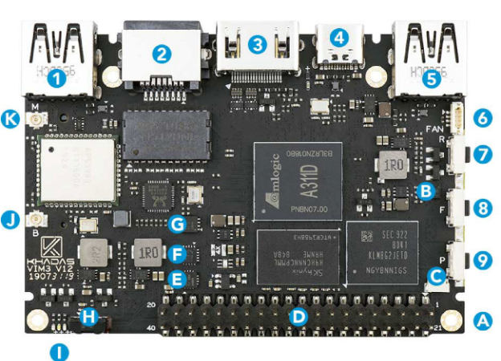

# Habilitando o Led Azul

<figure markdown>
  { width="600" }
  <figcaption>
  Image by <a href="https://pixabay.com/users/jacekabramowicz-1981807/?utm_source=link-attribution&amp;utm_medium=referral&amp;utm_campaign=image&amp;utm_content=1202125">Jacek Abramowicz</a> from <a href="https://pixabay.com//?utm_source=link-attribution&amp;utm_medium=referral&amp;utm_campaign=image&amp;utm_content=1202125">Pixabay</a>
  </figcaption>
</figure>

## Introdução

A [Khadas VIM3](https://www.khadas.com/vim3) possui um conjunto de 3 LEDs soldados na placa, os LEDs ==Branco==, ==Vermelho==, ==Azul==. Na versão do [*kernel Linux Android amlogic-bmeson-5.4*](https://android.googlesource.com/kernel/hikey-linaro/+/refs/heads/android-amlogic-bmeson-5.4), o LED Azul não vem habilitado por padrão. Nesse *post* vou descrever os passos que utilizei para deixar esse LED acessível ao Android.

## Informações Úteis

- Versão do AOSP: `android-12.0.0_r4`
- Versão do Kernel Android: `android-amlogic-bmeson-5.4`
- Distro de Compilação: `Linux Mint 21`
- Versão do Kernel da distro: `5.15.0-56-generic`

## O GPIO do LED Azul

Os LEDs da placa estão na letra `I` da imagem abaixo ([Fonte](https://docs.khadas.com/products/sbc/vim3/hardware/interfaces)):

<figure markdown>
  { width="600" }
  <figcaption>
  Vista de cima da VIM3 
  </figcaption>
</figure>

É preciso saber qual desses LEDs é o azul e a qual GPIO ele está conectado. Para isso, é necessário buscar no esquemático da placa, que pode ser encontrado nesse [link](https://dl.khadas.com/products/vim3/schematic/). Procurando por `BLUE`, podemos encontrar a porta que ativa o LED.

<figure markdown>
  { width="600" }
  <figcaption>
  Esquemático do LED azul
  </figcaption>
</figure>

Ele mostra que o sinal que ativa o LED azul é o `PWR_LED`. Buscando no esquemático pelo componente que envia esse sinal, temos:

<figure markdown>
  { width="600" }
  <figcaption>
  Fonte do sinal PWR_LED
  </figcaption>
</figure>

O [STM8S](https://www.st.com/en/microcontrollers-microprocessors/stm8s-series.html) é um microcontrolador de 8 bits, ele é responsável por fazer o controle de outros componentes da placa. Ele é controlado via `i2c`  pelo endereço `0x18` e possui alguns comando pré-determinados para que possamos controlar os componentes que estão associados a ele.

> Para mais detalhes sobre o STM8S veja [Habilitando a FAN](fan.md))

## Habilitando o LED

Para ter acesso ao `STM8S` eu adicionei o seguinte código ao [*kernel Linux Android amlogic-bmeson-5.4*](https://android.googlesource.com/kernel/hikey-linaro/+/refs/heads/android-amlogic-bmeson-5.4):

```{.dts title=arch/arm64/boot/dts/amlogic/meson-g12b-a311d-khadas-vim3.dts}
...

&i2c_AO {
  khadas-mcu {
    compatible = "khadas-mcu";
    reg = <0x18>;
    fan,trig_temp_level0 = <50>;
    fan,trig_temp_level1 = <60>;
    fan,trig_temp_level2 = <65>;
    fan,trig_temp_level3 = <70>;
    hwver = "VIM3.V11";
  };
};
```
Com isso, é possível acessar o `STM8S` via `adb shell`. Agora resta saber como ativar o LED azul. Para isso, é necessário saber qual comando deve ser enviado para o `STM8S`. Checando a escassa documentação da placa, encontrei o seguinte pdf [vim3_mcu_reg_en](https://dl.khadas.com/products/vim3/mcu/vim3_mcu_reg_en.pdf) que possui as seguintes linhas:

| Address | Register name | Byte | R/W | Note                                                                                                                     |
|---------|---------------|------|-----|--------------------------------------------------------------------------------------------------------------------------|
| 0x28    | LED_MODE_ON   | 1    | R/W | 0:LED Off after Power On<br>1:LED On after Power On<br>2:LED Breath after Power On<br>3:LED Heartbeat after Power On     |
| 0x29    | LED_MODE_OFF  | 1    | R/W | 0:LED Off after Power Off<br>1:LED On after Power Off<br>2:LED Breath after Power Off<br>3:LED Heartbeat after Power Off |

Com base nessas linhas, o LED azul pode ter um comportamento quando a placa está ligada e outro comportamento quando a placa está desligada.

## Testando

Depois de buildar o Kernel e o AOSP e flashar as imagens, utilizei o `adb shell` para fazer os testes. 

Primeiro chequei para ver se o endereço `0x18`estava disponível no barramento `0` (é necessário ter permissão de ==super usuário==):

```{.sh}
jaoboard:/ # i2cdetect -y 0 # barramento 0 do i2c
     0  1  2  3  4  5  6  7  8  9  a  b  c  d  e  f
00:          -- -- -- -- -- -- -- -- -- -- -- 0e --
10: -- -- -- -- -- -- -- -- 18 -- -- -- -- -- -- --
20: UU -- 22 -- -- -- -- -- -- -- -- -- -- -- -- --
30: -- -- -- -- -- -- -- -- -- -- -- -- -- -- -- --
40: -- -- -- -- -- -- -- -- -- -- -- -- -- -- -- --
50: -- 51 -- -- -- -- -- -- -- -- -- -- -- -- -- --
60: -- -- -- -- -- -- -- -- -- -- -- -- -- -- -- --
70: -- -- -- -- -- -- -- --   
```

com o endereço `0x18` disponível, usei o seguinte comando para deixar o LED azul piscando enquanto a placa estiver ligada:

```{.sh}
i2cset 0 0x18 0x28 3 w  -y # Heartbeat
```

<figure markdown>
  { width="600" }
  <figcaption>
  LED Azul piscando
  </figcaption>
</figure>

Para mudar o comportamento do LED azul para a placa desligada, basta mudar o registrador de `0x28` para `0x29`. Por exemplo:

```{.sh}
i2cset 0 0x18 0x29 3 w  -y # Heartbeat
```

## Conclusão

Agora os 3 LEDs disponíveis na Khadas VIM3 podem ser utilizados, no futuro a ideia é criar um *Device Driver* para controlar o LED azul. Os outros (Branco e Vermelho) já pertencem a categoria de `UserLed` e podem ser encontrados em `/sys/class/leds/` com os nomes `vim3:white:sys` e  `vim3:red`. Devido isso, podem ter seu comportamento alterado de acordo com o arquivo `trigger`, por exemplo:

```{.sh}
jaoboard:/sys/class/leds/vim3:red $ cat trigger                                
[none] rc-feedback bluetooth-power rfkill-any rfkill-none mmc0 timer 
oneshot disk-activity disk-read disk-write ide-disk heartbeat backlight 
gpio cpu cpu0 cpu1 cpu2 cpu3 cpu4 cpu5 default-on transient panic mmc2 mmc1 
hci0-power rfkill0 rfkill1 rfkill2 
```
