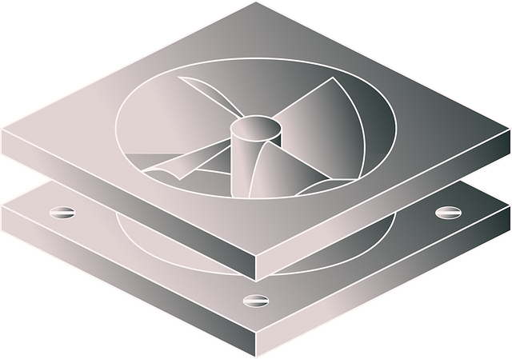
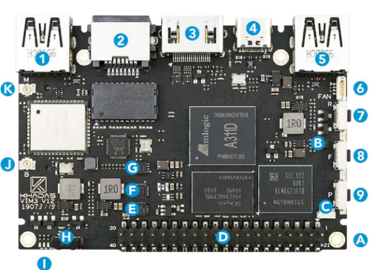
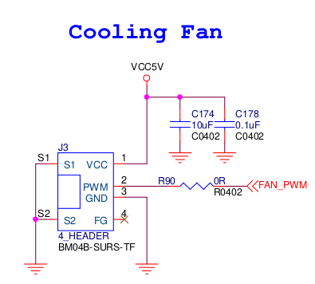
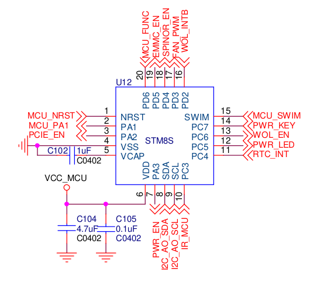

# Habilitando a FAN

<figure markdown>
  { width="600" }
  <figcaption>
  Image by <a href="https://pixabay.com/users/clker-free-vector-images-3736/?utm_source=link-attribution&amp;utm_medium=referral&amp;utm_campaign=image&amp;utm_content=304929">Clker-Free-Vector-Images</a> from <a href="https://pixabay.com//?utm_source=link-attribution&amp;utm_medium=referral&amp;utm_campaign=image&amp;utm_content=304929">Pixabay</a>
  </figcaption>
</figure>

## Introdução

A [Khadas VIM3](https://www.khadas.com/vim3) possui alguns acessórios, dentre eles a [ventoinha](https://www.khadas.com/product-page/3705-cooling-fan). Não tenho certeza se ela já vem habilitada com o sistema que vem por padrão na placa (*Android Pie (9)*), mas na versão do [*kernel Linux*](https://github.com/khadas/khadas-linux-kernel) que eles mantém, a ventoinha já está adicionada. 

Infelizmente na versão do [*kernel Linux Android*](https://android.googlesource.com/kernel/hikey-linaro/+/refs/heads/android-amlogic-bmeson-5.4) que estou utilizando nesse momento, a ventoinha ainda não foi adicionada. Dessa forma, nesse *post* vou descrever os passos que segui para conseguir utilizar a mesma.


## Informações Úteis

- Versão do AOSP: `android-12.0.0_r4`
- Versão do Kernel Android: `android-amlogic-bmeson-5.4`
- Distro de Compilação: `Linux Mint 21`
- Versão do Kernel da distro: `5.15.0-56-generic`

## A porta da FAN

O conector da FAN está no número `6` da imagem abaixo ([Fonte](https://docs.khadas.com/products/sbc/vim3/hardware/interfaces)):

<figure markdown>
  { width="600" }
  <figcaption>
  Vista de cima da VIM3 
  </figcaption>
</figure>

Agora é preciso saber onde estas portas estão conectadas internamente. Para isso, é necessário buscar no esquemático da placa, que pode ser encontrado nesse [link](https://dl.khadas.com/products/vim3/schematic/). Procurando por `FAN`, podemos encontrar a porta mencionada anteriormente no esquemático.

<figure markdown>
  { width="600" }
  <figcaption>
  Esquemático do conector da FAN
  </figcaption>
</figure>

Com isso, é possível observar que existem os seguintes sinais: `VCC`, `GND` e `FAN_PWM`. Dessa forma, o pino de controle da ventoinha é o `FAN_PWM`, é preciso saber de onde este sinal está vindo. Para isso, basta buscar no esquemático por `FAN_PWM` e o componente abaixo será encontrado.

<figure markdown>
  { width="600" }
  <figcaption>
  Fonte do sinal FAN_PWM
  </figcaption>
</figure>

O [STM8S](https://www.st.com/en/microcontrollers-microprocessors/stm8s-series.html) é um microcontrolador de 8 bits, ele é responsável por fazer o controle da ventoinha (pino 17). Ainda no esquemático, é possível observar que esse microcontrolador é controlado por `i2c` (pinos 8 e 9) sendo estes do próprio `SOC`. O esquemático não fornece o endereço, para controlar esse microcontrolador, ou seja, não temos como ter acesso a esse componente.

## O Endereço do STM8S

Como a FAN está adicionado ao *Kernel Linux* mantido pela Khadas, então a informação do endereço do microcontrolador está em algum lugar do código (==mas onde ?==). Ainda observando as portas do STM8S no esquemático, é possível perceber algumas menções de `MCU` (sigla para *MicroController Unit*). A partir disso, é muito provável que qualquer endereço de `i2c` esteja em algum *Device Tree Source* (DTS) dentro do *Kernel Linux* da *Khadas*. Os DTS da `VIM3` estão em `arch/arm64/boot/dts/amlogic/` e nesse caminho busquei por `MCU`  e retornaram os seguintes arquivos: 

```{.sh}
╭─ ~/Doc/b/V/2/linux-vim3/a/arm6/b/d/amlogic on khadas-vim3-p-64bit 
╰─❯ grep -r mcu                                                              ─╯
tm2_t962x3_t312.dts:			/*mcu irq pin*/
tm2_t962x3_t312.dts:			mcu_irq_pin = <&gpio GPIOH_9 GPIO_ACTIVE_HIGH>;
kvim3.dts:       khadas-mcu {
kvim3.dts:               compatible = "khadas-mcu";
axg_s400_v03sbr.dts:	mcu6350: mcu6350@40 {
axg_s400_v03gva_sbr.dts:	mcu6350: mcu6350@40 {
kvim3.dts11:       khadas-mcu {
kvim3.dts11:               compatible = "khadas-mcu";
kvim3.dtsbak:       khadas-mcu {
kvim3.dtsbak:               compatible = "khadas-mcu";
kvim3.dtspdm:       khadas-mcu {
kvim3.dtspdm:               compatible = "khadas-mcu";
kvim3.dts_dai:       khadas-mcu {
kvim3.dts_dai:               compatible = "khadas-mcu";
kvim3l.dts:	khadas-mcu {
kvim3l.dts:		compatible = "khadas-mcu";
```

> A branch que eu utilizei foi a *khadas-vim3-p-64bit*

O arquivo `kvim3.dts` pareceu promissor, checando a linha retornada anteriormente:

```{.dts title=kvim3.dts}
&i2c_AO {
  status = "okay";
  pinctrl-names="default";
  pinctrl-0=<&ao_i2c_master_pins1>;
  clock-frequency = <100000>; /* default 100k */

  khadas-mcu {
    compatible = "khadas-mcu";
    reg = <0x18>;
    fan,trig_temp_level0 = <50>;
    fan,trig_temp_level1 = <60>;
    fan,trig_temp_level2 = <65>;
    fan,trig_temp_level3 = <70>;
    hwver = "VIM3.V11";
  };
  ...
};
```
Um *node* chamado `khadas-mcu` dentro do *node* `i2c_AO` (o mesmo que controla o STM8S). Ainda é possível observar que o endereço utilizado é o ==0x18== (`reg = <0x18>;`). Agora resta testar.

## Testando no Kernel Android

Para testar, adicionei o seguinte conteúdo no final do arquivo:

```{.dts title=arch/arm64/boot/dts/amlogic/meson-g12b-a311d-khadas-vim3.dts}
...

&i2c_AO {
  khadas-mcu {
    compatible = "khadas-mcu";
    reg = <0x18>;
    fan,trig_temp_level0 = <50>;
    fan,trig_temp_level1 = <60>;
    fan,trig_temp_level2 = <65>;
    fan,trig_temp_level3 = <70>;
    hwver = "VIM3.V11";
  };
};
```

Dessa forma, é possível ter acesso ao componente que tenha o endereço `0x18` (ainda não é certeza que seja o `STM8S`). Buildando o Kernel com essas alterações e adicionando ao AOSP, so resta flashar o `boot.img` e checar se o endereço `0x18` está disponível. Para isso, é possível utilizar o comando `i2cdetect`, por meio do `adb shell`. O retorno do comando foi o seguinte:

```{.sh}
╰─❯ adb shell
jaoboard:/ # i2cdetect -y 0                                                    
     0  1  2  3  4  5  6  7  8  9  a  b  c  d  e  f
00:          -- -- -- -- -- -- -- -- -- -- -- 0e --
10: -- -- -- -- -- -- -- -- 18 -- -- -- -- -- -- --
20: UU -- 22 -- -- -- -- -- -- -- -- -- -- -- -- --
30: -- -- -- -- -- -- -- -- -- -- -- -- -- -- -- --
40: -- -- -- -- -- -- -- -- -- -- -- -- -- -- -- --
50: -- 51 -- -- -- -- -- -- -- -- -- -- -- -- -- --
60: -- -- -- -- -- -- -- -- -- -- -- -- -- -- -- --
70: -- -- -- -- -- -- -- --       
```
Tudo caminhando bem, endereço `0x18` habilitado. Entretanto, existe um problema, mesmo que o endereço seja o do `STM8S`, ele é apenas uma interface para controlar a FAN. Dessa forma, existe um *firmware* gravado nele (na qual não temos acesso) que dado uma entrada ele executa uma saída.

Checando a escassa documentação da placa, encontrei o seguinte pdf [vim3_mcu_reg_en](https://dl.khadas.com/products/vim3/mcu/vim3_mcu_reg_en.pdf) que não faz nenhuma menção ao `STM8S`, mas possui a seguinte linha:

| Address 	| Register Name       	| Byte 	| R/W 	| Note                                                                                   	|
|---------	|---------------------	|------	|-----	|----------------------------------------------------------------------------------------	|
| 0x88    	| CMD_FAN_STATUS_CTRL 	| 0    	| W   	| 0：Disable Fan<br>1：Fan Speed Level 1<br>2：Fan Speed Level 2<br>3：Fan Speed Level 3 	|

Fiz o seguinte teste no shell do Android:

```{.sh}
jaoboard:/ # i2cset 0 0x18 0x88 1 w                                            
Write register 0x88 from chip 0x18 on bus 0? (Y/n):
```

e *Voilà* a ventoinha começou a girar.

<figure markdown>
  { width="600" }
  <figcaption>
  Ventoinha funcionando
  </figcaption>
</figure>

## Conclusão

Sem dúvidas, a falta de documentação para as placas em geral é um grande problema e isso dificulta o *Bring up* das mesmas. Se não tiver uma equipe interna para fazer as implementações, é praticamente impossível fazer alguma coisa funcionar. Como foi possível perceber nesse *post*, se não fosse alguém da própria khadas para gerar o DTS com o endereço, a ventoinha seria inacessível, uma vez que existe uma interface para controla-la. Mas no fim, deu tudo certo e seguimos na luta para aprender sobre embarcados :).