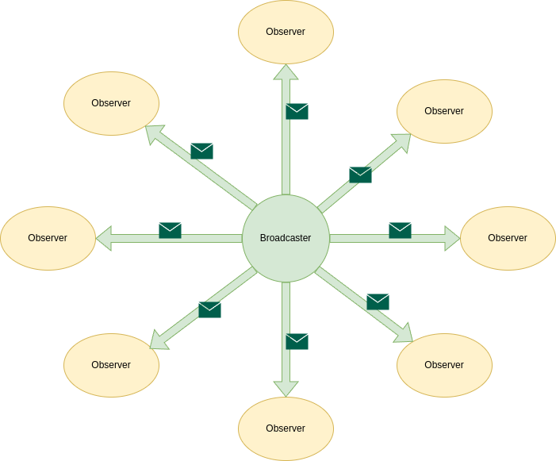
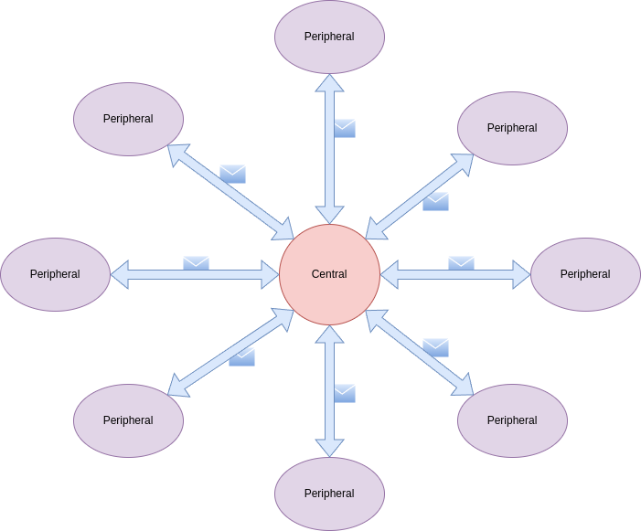

# Topologias

<figure markdown>
  { width="600" } 
  <figcaption>
    Image by <a href="https://pixabay.com/users/publicdomainpictures-14/?utm_source=link-attribution&utm_medium=referral&utm_campaign=image&utm_content=313670">PublicDomainPictures</a> from <a href="https://pixabay.com//?utm_source=link-attribution&utm_medium=referral&utm_campaign=image&utm_content=313670">Pixabay</a>
  </figcaption>
</figure>

> Minhas bases de pesquisa foram os curso da nordic: [Bluetooth Low Energy Fundamentas](https://academy.nordicsemi.com/courses/bluetooth-low-energy-fundamentals/) e os livros: [Getting Started with Bluetooth Low Energy](https://www.amazon.com.br/Getting-Started-Bluetooth-Low-Energy/dp/1491949511/) e [Intro to Bluetooth Low Energy](https://www.amazon.com.br/Intro-Bluetooth-Low-Energy-easiest-ebook/dp/B07KTDG6KG/)

## Introdução

Atualmente venho estudando sobre *Bluetooth Low Energy* (BLE). Existem muitos conceitos atrelado a essa tecnologia, uma delas é sobre a topologia que a rede pode assumir. São elas *broadcasting* e *connections*. A ideia é fazer análises bem sucinta e depois ir conectando os assuntos para no final ter um entendimento sólido sobre BLE.

## O Broadcasting e Observing

Usando uma transmissão sem conexão (*broadcasting*) é possivel que um dispositivo (*broadcaster*) mande dados para quaisquer outros dispositivos (*observer*) que estejam ao alcance dessa transmissão. Em outras palavras é uma transmissão **um para muitos** 

<figure markdown>
  { width="600" }
  <figcaption>
  Broadcasting e Observing
  </figcaption>
</figure>

!!! note "Broadcaster"
    Envia um pacote de anúncio (*advertising*) com a flag **nonconnectable** periodicamente para os *observers*

!!! note "Observer"
    Verificar periodicamente as frequências pre-definidas para receber quaisquer pacotes de *advertising*.

Por padrão, o pacote de *advertising* contém 31 bytes de *payload* para descrever o *broadcaster* e suas *capabilities*, mas também é possível enviar informações customizadas. Se os 31 bytes não forem suficientes, o BLE também tem um suporte opcional a um *advertising* secundário chamado de *Scan Response*. Isso permite que ao detectar um *broadcaster*, o *observer* pode requisitar um *advertising* secundário com mais 31 bytes, resultando em 62 bytes no total.

Uma das principais desvantagens de usar o *broadcasting* é que ele não possui segurança ou privacidade no momento de transmitir os dados. Dessa forma, para dados sensiveis é inviável utilizar essa topologia.

## Centrais e Periféricos

Além de *broadcasting* e *oberserver*, também existem outras nomeclaturas utilizadas, como *BLE peripheral* e *BLE centrals*.

### BLE Peripherals

Os dispositivos *peripherals* anunciam sua presença enviando um pacote de *advertising* e aceita conexão de dispositivos *centrals*. Outro termo também utilizado é *BLE Broadcaster*, ou seja, é o dispositivo que envia pacotes de *advertising*. A diferença entre o *peripheral* e o *broadcaster* é que o *broadcaster* não aceita conexão de um dispositivo *central*, isso porque é enviado a flag **nonconnectable** (como visto anteriormente) no seu pacote. Dessa forma, o *observer* apenas sabe que existe um dispositivo enviando pacotes de *advertising*, mas não pode iniciar uma conexão ou se conectar. O exemplo mais difundido de *BLE broadcaster* é o **Beacon**.

### BLE Centrals

Um dispositivo *central* é responsável por descobrir (ou escutar) por outros dispositivos BLE que estão mandando seu pacote de *advertising*. Além disso, é capaz de estabelecer uma conexão com os *BLE peripherals*. O *observer* é similar, mas não é capaz de iniciar uma conexão com um *BLE peripheral*.

<figure markdown>
  { width="600" }
  <figcaption>
  Peripheral e Central
  </figcaption>
</figure>

!!! note "Peripheral"
    Envia um pacote de *advertising* periodicamente para os *central* aguardando um pedido de conexão.

!!! note "Central"
    Verificar periodicamente as frequências pre-definidas para receber quaisquer pacotes de *advertising* e então fazer uma requisição de conexão.

## Conclusão

Nesse post eu tentei mostrar a diferença entre *broadcaster* e *peripheral*, que são responsáveis por enviar o pacote de *advertising*. Além da diferença entre *oberserver* e *central*, que recebem o pacote de *advertising*. Essas nomeclaturas fazem muita confusão quando se está iniciando nesse mundo do *bluetooth*. Por isso, resolvi escrever sobre esse assunto que é apenas o começo da teoria de BLE.