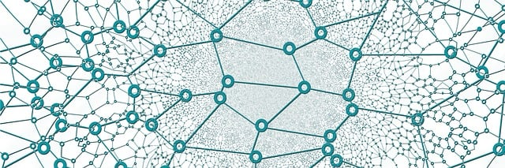

# Grafos

<figure markdown>
  { width="600" } 
  <figcaption>
  Image by <a href="https://pixabay.com/users/geralt-9301/?utm_source=link-attribution&utm_medium=referral&utm_campaign=image&utm_content=3139214">Gerd Altmann</a> from <a href="https://pixabay.com//?utm_source=link-attribution&utm_medium=referral&utm_campaign=image&utm_content=3139214">Pixabay</a>
</figure>


## Introdução

Buscando estudar para a prova do mestrado, resolvi voltar a estudar sobre **Algoritmos e Estrutura de dados**. Com isso,  acabei comprando alguns livros sobre o assunto, sendo um deles o [*grokking algorithms*](https://www.amazon.com/Grokking-Algorithms-illustrated-programmers-curious/dp/1617292230). Baseado nesse livro, achei interessante a forma como ele abordou a questão de grafos, o que gerou esse post.

## Grafos

Um grafo modela um conjunto de conexões. Suponha que você e seus amigos queiram saber quem são seus amigos em comum. Você poderia começar com: "João é amigo de Pedro"

<figure markdown>
  { width="600" }
  <figcaption>
  Grafo Simples
  </figcaption>
</figure>


Um grafo completo poderia algo como:

<figure markdown>
  { width="600" }
  <figcaption>
  Grafo Complexo
  </figcaption>
</figure>

João é amigo de pedro, Diego é amigo de Pedro, e assim por diante. Cada grafo é feito por vértices (ou *nodes*) e arestas (ou *edges*)

<figure markdown>
  { width="600" }
  <figcaption>
  Composição de um grafo
  </figcaption>
</figure>

Um vértice pode ser diretamente conectado a vários outros vértices. Esses vértices são chamados de **vizinhos**. No grafo, Pedro é **vizinho**  de João. Lucas não é **vizinho** de João, porque eles não estão diretamente conectados. Porém, Lucas é **vizinho** de Pedro e Diego.

Grafos são um jeito de modelar diferentes coisas que estão conectadas.

## Implementando um Grafo

Um grafo consiste em vários vértices e cada vértice está conectado a seus vizinhos. Para expressar essa relação, é possível utilizar **Tabela Hash**. Ela permite mapear uma chave a um valor. Nesse caso, mapear um vértice a todos os seus vizinhos.

```{.py title=Grafo.py}
grafo = {}
grafo["Joao"] = ["Pedro"]
grafo["Diego"] = ["Pedro", "Lucas"]
grafo["Pedro"] = ["Lucas"]
grafo["Lucas"] = []
```

Dessa implementação podemos concluir que:
- Lucas não possui vizinho, pois ele possui arestas apontando para ele, mas não possui aresta saindo dele e apontando para alguém. A relação é de apenas uma via, isso é chamado de **grafo direcionado**

<figure markdown>
  { width="600" }
  <figcaption>
  Grafo Direcionado
  </figcaption>
</figure>

Para representar uma relação de via dupla, onde os vértices são vizinhos um do outro. Temos o conceito de grafos **não-direcionados**

<figure markdown>
  { width="600" }
  <figcaption>
  Grafo Não-direcionado
  </figcaption>
</figure>

!!! Warning "Atenção"
    Observe que não há setas apontando a direção.


O grafo acima é equivalente a

<figure markdown>
  { width="600" }
  <figcaption>
  Grafo Não-direcionado equivalente
  </figcaption>
</figure>


Dessa forma, é possível representar um **grafo não-direcionado** dessas duas formas.

## Conclusão

Foi apresentado de uma forma bem simplificado o que são grafos. A ideia principal não é estudar grafos afundo, mas entender o necessário para estudar os algoritmos que fazem uso deles, como por exemplo o *Breadth-First Search* (BFS), que faz o uso de grafos para encontrar o menor caminho entre 2 pontos (ou vértices).