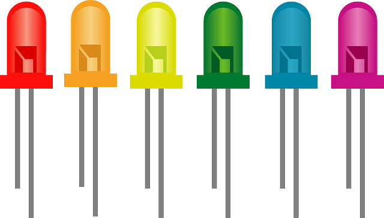

# GPIO


<figure markdown>
  { width="600" }
  <figcaption>
    Image by <a href="https://pixabay.com/users/clker-free-vector-images-3736/?utm_source=link-attribution&utm_medium=referral&utm_campaign=image&utm_content=26354">Clker-Free-Vector-Images</a> from <a href="https://pixabay.com//?utm_source=link-attribution&utm_medium=referral&utm_campaign=image&utm_content=26354">Pixabay</a>
  </figcaption>
</figure>


## Introdução

Trabalhar com **General Purpose Input Output** (GPIO) no Linux não é a coisa mais simples do mundo, quando é a primeira vez que você vai utiliza-los. Por isso, achei interessante compartilhar esses passos.

> Gostaria agradecer ao [Cristiano Goes](https://www.linkedin.com/in/cristiano-goes-g035/) pelo suporte.

!!! note "Nota"
    Se quiser se aprofundar mais um pouco, existe o curso [Embedded Linux Step by Step Using Beaglebone Black](https://www.udemy.com/share/101X4W/) que na seção 15 dá mais detalhes sobre o que será explicado aqui.

## O Kernel

Precisamos checar como os GPIOs foram configuradas dentro do Kernel Linux. Por se tratar de uma configuração, elas devem estar dentro do *Device Tree Source* (DTS) da placa. Fazendo uma busca, encontrei o arquivo:

```{.dts hl_lines="3" title="arch/arm64/boot/dts/amlogic/meson-khadas-vim3.dtsi"}
#include <dt-bindings/input/input.h>
#include <dt-bindings/leds/common.h>
#include <dt-bindings/gpio/meson-g12a-gpio.h>
#include <dt-bindings/sound/meson-g12a-tohdmitx.h>
```

O arquivo `meson-g12a-gpio.h` se encontra em `include/dt-bindings/gpio/meson-g12a-gpio.h`. O arquivo divide os GPIOs em 2 grupos:

1. *First GPIO chip*
```{.c}
/* First GPIO chip */
#define GPIOAO_0 0
#define GPIOAO_1 1
#define GPIOAO_2 2
#define GPIOAO_3 3
...
```

2. *Second GPIO chip*
```{.c}
/* Second GPIO chip */
#define GPIOZ_0 0
#define GPIOZ_1 1
#define GPIOZ_2 2
#define GPIOZ_3 3
#define GPIOZ_4 4
...
```

### Grupo 1

O primeiro grupo possui os bancos:
- `GPIOAO` de 12 bits 
- `GPIOE` com 3 bits. 

### Grupo 2

O segundo grupo é maior, com vários bancos:

- `GPIOZ` de 16 bits
- `GPIOH` de 9 bits
- `BOOT` de 16 bits
- `GPIOC` de 8 bits
- `GPIOA` de 16 bits (não confundir com `GPIOAO` do primeiro grupo)
- `GPIOX` de 20 bits


### Mapeando os pinos

As GPIOs disponíveis no sistema estão no caminho `/sys/class/gpio/`, na VIM 3 podemos encontrar os seguintes items:

```{.txt }
$ ls /sys/class/gpio
export  gpiochip412  gpiochip427  unexport
```

O `export` serve para ativar um GPIO e o `unexport` para desativar. Os itens `gpiochip412` e `gpiochip427` são referentes aos 2 grupos mostrados anteriormente. 

> Para os mais curiosos, esses 2 grupos foram criados dentro do arquivo `drivers/pinctrl/meson/pinctrl-meson-g12a.c`. Nas estruturas `meson_g12a_periphs_pinctrl_data` e `meson_g12a_aobus_pinctrl_data`

Utilizando o comando `ls -l`, podemos observar que esses 2 grupos estão associados a outras pastas:

```{.sh}
$ ls -l

total 0
--w-------    1 0        0             4096 Jan  1 00:00 export
lrwxrwxrwx    1 0        0                0 Jan  1 00:00 gpiochip412 -> ../../devices/platform/soc/ff800000.bus/ff800000.sys-ctrl/ff800000.sys-ctrl:pinctrl@14/gpio/gpiochip412
lrwxrwxrwx    1 0        0                0 Jan  1 00:00 gpiochip427 -> ../../devices/platform/soc/ff600000.bus/ff634400.bus/ff634400.bus:pinctrl@40/gpio/gpiochip427
--w-------    1 0        0             4096 Jan  1 00:00 unexport
```

O GPIO `gpiochip412` está associado ao `ff800000.sys-ctrl` e o `gpiochip427` está associado ao `ff634400.bus`.

!!! warning "Atenção"
    Para o passo a seguir, certifique-se de que o debugfs está montado.


Até esse momento não sabemos identificar os GPIOs que estão dentro do arquivo `include/dt-bindings/gpio/meson-g12a-gpio.h`. Para auxiliar nisso, podemos ir para o caminho `/sys/kernel/debug/pinctrl/`. Nesse caminho temos os seguintes itens

```shell
$ ls /sys/kernel/debug/pinctrl/

ff634400.bus:pinctrl@40-pinctrl-meson
ff800000.sys-ctrl:pinctrl@14-pinctrl-meson
pinctrl-devices
pinctrl-handles
pinctrl-maps

```


Os mesmos nomes que estão associados aos `gpiochips*` aparecem aqui. Podemos ver o conteúdo do arquivo `pins`. Por exemplo,

```
$ cat ff800000.sys-ctrl:pinctrl@14-pinctrl-meson/pins

registered pins: 15
pin 0 (GPIOAO_0) 0:aobus-banks  ff800000.sys-ctrl:pinctrl@14
pin 1 (GPIOAO_1) 1:aobus-banks  ff800000.sys-ctrl:pinctrl@14
pin 2 (GPIOAO_2) 2:aobus-banks  ff800000.sys-ctrl:pinctrl@14
pin 3 (GPIOAO_3) 3:aobus-banks  ff800000.sys-ctrl:pinctrl@14
pin 4 (GPIOAO_4) 4:aobus-banks  ff800000.sys-ctrl:pinctrl@14
pin 5 (GPIOAO_5) 5:aobus-banks  ff800000.sys-ctrl:pinctrl@14
pin 6 (GPIOAO_6) 6:aobus-banks  ff800000.sys-ctrl:pinctrl@14
...
```

No caminho `ff800000.sys`, que está associado ao `gpiochip412`, estão registrados 15 pinos e em seguida aparece o nome dos pinos registrados. Dessa forma, agora sabemos que o `gpiochip412` é referente ao grupo 1.

Fazendo o mesmo para o  `ff634400.bus`:

```
$ cat ff634400.bus:pinctrl@40-pinctrl-meson/pins

registered pins: 85
pin 0 (GPIOZ_0) 0:periphs-banks  ff634400.bus:pinctrl@40
pin 1 (GPIOZ_1) 1:periphs-banks  ff634400.bus:pinctrl@40
pin 2 (GPIOZ_2) 2:periphs-banks  ff634400.bus:pinctrl@40
pin 3 (GPIOZ_3) 3:periphs-banks  ff634400.bus:pinctrl@40
pin 4 (GPIOZ_4) 4:periphs-banks  ff634400.bus:pinctrl@40
...
```

E confirmamos que está associado ao grupo 2.

## Ativando um GPIO

Vamos supor que queremos utilizar o GPIO `GPIOH_4` (que está no grupo 2). Já sabemos que ele está associado ao `gpiochip427`, mas precisamos de 2 informações importantes, saber qual é a **base**
e o **offset**.

A **base**, podemos conseguir por meio do comando:

```
$ cat  /sys/class/gpio/gpiochip427/base
427
```

O comando retorna o número 427 (sim, o nome do gpiochip é concatenado com a base). O **offset** pode ser obtido por meio do arquivo `include/dt-bindings/gpio/meson-g12a-gpio.h` ou checando os `pins` pelo `/sys/kernel/debug/pinctrl/`. Nesse caso, o GPIO `GPIOH_4` tem o **offset** 20.

!!! note "Nota"
    Podemos fazer um paralelo, dizendo que a **base** é como se fosse a rua da sua casa e o **offset**  é número da casa.

Agora basta somar a **base** + **offset** = 427 + 20 = 447.

Com isso, digitar o comando:

```
echo 447 > /sys/class/gpio/export
```

Checando novamente a pasta

```
$ ls /sys/class/gpio/
export       gpio447      gpiochip412  gpiochip427  unexport

```

Agora temos o `gpio447` pronto para uso.


## Usando o GPIO

Antes de utilizarmos um GPIO, precisamos saber se ele está "externado", ou seja, se ele está disponível para uso na placa. Para saber quais os GPIOs estão disponíveis para uso, devemos consultar o esquemático da placa, para a VIM3 temos os seguintes pinos:

<figure markdown>
  { width="600" }
  <figcaption>
  GPIOs externadas
  </figcaption>
</figure>

Esses são os 40 pinos que estão disponíveis na placa.

Podemos observar que o pino 37 é o `GPIOH_4`, que foi o mesmo que ativamos anteriormente. Acessa esse GPIO, temos:

```{.bash}
# ls /sys/class/gpio/gpio447/
active_low  direction   subsystem   value
device      power       uevent
```

Por hora, vamos dar enfaze em `direction` e `value`. O `direction` é responsável por definir se o GPIO será de entrada ou saída, para saber o estado atual, basta checar o seu conteúdo:

```{.sh}
# cat /sys/class/gpio/gpio447/direction 
out 
```

Nesse caso, o `GPIOH_4` está setado para saída (mas poderia estar setado para entrada `in`). Para exemplificar, vamos utilizar um LED, sendo necessário que o GPIO esteja setado para saída.

!!! note "Nota"
    Para alterar a direção do GPIO, basta utilizar o comando echo. Por exemplo: `echo in > direction` ou `echo out > direction`

Agora precisamos configurar seu valor para **high** ou **low**. Isso é feito por meio do arquivo `value`, para checar o valor atual:

```{.sh}
# cat /sys/class/gpio/gpio447/value 
0
```

Nesse caso, o valor atual é **low**. Para mudar para **high**, podemos utilizar o comando:

```{.sh}
# echo 1 > /sys/class/gpio/gpio447/value 
```

Por fim, uma vez que já sabemos ligar e desligar um LED, podemos gerar um shell script para fazermos o blink:

```{.sh}
# while ( true ); do 
    echo 1 > /sys/class/gpio/gpio447/value; 
    sleep .5; 
    echo 0 > /sys/class/gpio/gpio447/value;
    sleep .5; 
done;
```

<figure markdown>
  { width="600" }
  <figcaption>
  Blink Led
  </figcaption>
</figure>

## Conclusão

Foi feito um overview de como encontrar um GPIO e como utiliza-lo. Como cada placa possui SOCs diferentes, os nomes dos GPIOs serão diferentes, mas o processo de busca é o mesmo. Um erro pode ocorrer na hora de exportar (ativar) um GPIO caso o Kernel já esteja fazendo uso do mesmo, por isso, é preciso analisar os pinos que serão configurados.

